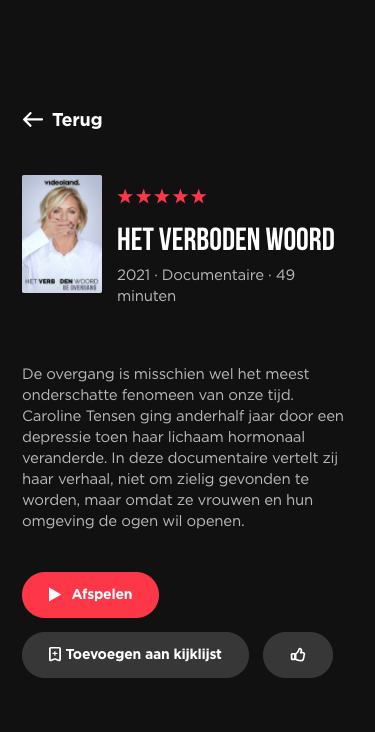

# Procesverslag
Markdown is een simpele manier om HTML te schrijven.  
Markdown cheat cheet: [Hulp bij het schrijven van Markdown](https://github.com/adam-p/markdown-here/wiki/Markdown-Cheatsheet).

Nb. De standaardstructuur en de spartaanse opmaak van de README.md zijn helemaal prima. Het gaat om de inhoud van je procesverslag. Besteedt de tijd voor pracht en praal aan je website.

Nb. Door *open* toe te voegen aan een *details* element kun je deze standaard open zetten. Fijn om dat steeds voor de relevante stuk(ken) te doen.

## Jij

uitwerken voor kick-off werkgroep

### Auteur:
Cera Dusseau

#### Je startniveau:
blauw

#### Je focus:
surface plane
 

## Je website

uitwerken voor kick-off werkgroep

### Je opdracht:

#### Screenshot(s) van de eerste pagina (small screen): 
Home page

#### Screenshot(s) van de tweede pagina (small screen):
Informatie pagina

 

## Breakdownschets (week 1)

uitwerken na afloop 2e werkgroep

### de hele pagina: 

### dynamisch deel (bijv menu): 

### dynamisch deel (bijv menu): 

## Voortgang 1 (week 2)

uitwerken voor 1e voortgang

### Stand van zaken
Ik vond de HTML goed gaan, ik heb tot zover geen DIV of Class gebruikt. Ik merk wel dat ik de CSS lastig vind en dat dat iets langzamer gaat omdat ik toch wel tegen veel dingen aanloop.

### Agenda voor meeting
samen met je groepje opstellen
student 1: "ik zou graag willen leren hoe je icoontjes aan een website toevoegd."
student 2: "ik zou graag willen leren hoe ik een hamburger menu maak."
student 3: "ik wil graag weten hoe je een foto carrousel maakt."   

### Verslag van meeting
hier na afloop snel de uitkomsten van de meeting vastleggen

- punt 1 Je kan icoontjes aan de <A> toevoegen door gewoon een img in de A te zetten
- punt 2 ik heb een opdracht toegestuurd gekregen waar ik even naar moet kijken.
- punt 3 Ik zou als eerst een 'neppe' variant maken. 
- ...

## Voortgang 2 (week 3)

uitwerken voor 2e voortgang

### Stand van zaken
Tijdens week twee heb ik me vooral gefocust op de CSS en een beetje op de Javascript. Ik merk dat ik Css lastig vind maar zodra de code werkt maakt dat veel goed. Ik heb deze week een hamburger menu werkend gemaakt en ben begonnen aan de tweede pagina zodat ik hierna alleen nog maar de CSS en Javascript hoef te doen

### Agenda voor meeting
samen met je groepje opstellen
student 1: "Ik zou deze week graag willen leren hoe ik een scrollbar maak voor foto's zodat mijn website bij een grotere layout meer foto's laat zien."
student 2: "Ook zou ik willen leren hoe ik een eigen gekozen font kan gebruiken."
student 3: 

### Verslag van meeting
hier na afloop snel de uitkomsten van de meeting vastleggen

- punt 1 ik heb geleerd hoe ik een scrollbar kan maken en als de pagina dan groter wordt hoe dit dan aanpast.
- punt 2 Ik heb geleerd hoe ik de tweede html pagina kon koppelen aan een css

## Toegankelijkheidstest (week 4)

uitwerken na test in 8e voortgang

### Bevindingen
Test met beperkingen
Noor Meijns:

Tunnel visie:
plaatje 1 is niet echt te zien. 
button is te zien maar niet helemaal goed. Moet ik nog afmaken
plaatjes zijn wel goed te zien verder
getallen zijn bij live tv wel goed te zien.

button’s op pagina 2 ook goed te zien.

diabetic disease:
Pagina is goed te lezen
grote is normaal
donkere plaatjes zijn lastiger om te zien.

Central field lost:
Tekst is moeilijker te lezen.
tekst in verder kijken is lastiger

Blur:
tekst niet te lezen tenzij je inzoomt
als je inzoomt is het goed te lezen

blur and central field lost:
heel lastig.
Plaatjes zijn niet te lezen
afspeel button is lastig te lezen.
werkt alleen als je je scherm groot maakt.
button’s op de tweede pagina zijn moeilijk te zien.

ADHD test
scrollen tijdens een afleiding is lastig. 
je vergeet snel wat je hebt aangeklikt
korte tekst is handig zodat je snel kan lezen wat er staat.

Parkinson:

Grote knoppen zijn wel chil

Alles met toetsenboard

als je begint bij de pagina kom je niet bij de nav dat is pas als je onderaan bent.
Meer de focus state uitwerken

#### Titel eerste bevinding
 
Voor de mensen die slecht ziend zijn en gebruik maken van screenreaders is het belangrijk dat er bij de alt een duidelijke omschrijving staat van wat er precies op het plaatje staat.

Om mijn site te verbeteren heb ik bij elke afbeelding alt een duidelijke omschrijving van de tekst gezet

#### Titel tweede bevinding. 
Voor de mensen die alleen maar met het toetsenbord door te pagina navigeren is het belangrijk dat de focus state goed werkt.

Om mijn site te verbeteren heb ik de focus state goed op laten vallen. Verder heb ik ook gebruik gemaakt van de active state zodat de gebruiker weet waar hij is op de site.

Dit laatste is ook handig voor mensen die snel afgeraakt zijn. Zij weten door de active state waar ze zich bevinden op de site.

#### Titel volgende bevinding. 
Ik voor de mensen die slecht ziend zijn en de site erg willen vergroten is het makkelijk als zij de tekst dus goed kunnen lezen en het niet 1 lange zin wordt.

Om mijn site te verbeteren heb ik de tekst een max-width gegeven zodat de tekst niet te groot wordt als je de pagina vergoot en zo nog makkelijk te lezen is.

#### Titel nog een bevinding. 
voor blur and central field lost vind ik het lastig iets te bedenken, buiten een goede voice over, zodat zij makkelijk door de site kunnen navigeren 

## Voortgang 3 (week 4)

uitwerken voor 3e voortgang

### Stand van zaken
Deze week ging het coderen best wel oke. Ik merkte dat ik het wat meer automatisch gaat en dat ik het leuk begin te vinden. Ik ben deze week met de laatste dingen bezig geweest om de puntjes op de I te zetten. Ik heb hier hulp bij gekregen van zowel Sanne als Sundous en ik ben heel blij dat beide me hebben geholpen.

### Agenda voor meeting

samen met je groepje opstellen
student 1: "Ik zou graag door mijn html code willen gaan en kijken of ik ergens nog aanpassingen moet doen."
student 2: "Ik heb bij mijn tweede pagina prince charming met een stuk tekst alleen ik krijg die tekst er niet naast."
student 3: "Ik vind het lastig om iets te bedenken om te verbeteren voor de screen reader."

### Verslag van meeting
hier na afloop snel de uitkomsten van de meeting vastleggen

- punt 1: De code ziet er netjes uit. Het is alleen netter als ik de sections in mijn eerste html pagina verander naar lists.
- punt 2: Dat kan ik doen door een grid.
- punt 3: Je kan de alts verduidelijken voor de screen reader.
- ...

## Eindgesprek (week 5)

uitwerken voor eindgesprek

### Stand van zaken
Week 5, wat voor mij eigenlijk alleen een weekend is omdat ik maandag het gesprek heb, ervaar ik als gespannen! Het coderen is in de afgelopen weken voor mij van "vreselijk" naar "toch best wel leuk" gegaan. Dit weekend ben ik bezig geweest met de read me af te maken, de sections in mijn index.html pagina te veranderen naar lists, de alt bij de foto's aan te passen naar duidelijke teksten voor de screen readers en als laatst heb ik de afbeeldingen die ik in eerste instantie gebruikte voor sommige teksten veranderd in daadwerkelijke teksten.

### Screenshot(s)

## Bronnenlijst

continu bijhouden terwijl je werkt

Nb. Wees specifiek ('css-tricks' als bron is bijv. niet specifiek genoeg).

Ik heb geen code gekopierd van het internet. De enige code die ik heb gekopierd is van Sanne. Hij heeft mij geholpen met het maken van "afleveringen" en "andere keken ook".

